# 🎮 Prime Gaming Store


---

## 👤 Identitas Mahasiswa

| Field | Detail |
|---|---|
| **Nama** | [Nalendra Waskita Hutama Putra] |
| **NIM** | [BD2303008] |
| **Program Studi** | D4 Bisnis Digital |
| **Mata Kuliah** | Mobile Programming |
| **Dosen Pengampu** | [Dziki Ridwanullah,M.Kom.] |

---

## 📱 Deskripsi Aplikasi

**Prime Gaming Store** adalah aplikasi mobile manajemen inventaris toko gaming yang dibangun menggunakan Flutter dan Isar Database. Aplikasi ini dirancang untuk membantu pemilik toko gaming dalam mengelola produk, memantau stok, dan mencatat transaksi penjualan secara digital langsung dari perangkat Android.

### Studi Kasus Bisnis
Banyak toko gaming masih melakukan pencatatan produk dan stok secara manual, yang menyebabkan proses pengelolaan data menjadi tidak efisien dan rentan terhadap kesalahan. Prime Gaming Store hadir sebagai solusi digital yang memungkinkan pemilik toko untuk:
- Mengelola katalog produk gaming (mouse, keyboard, headset, controller, dll)
- Memantau stok barang secara real-time
- Mencatat transaksi penjualan dan melihat riwayatnya
- Melihat statistik inventaris secara visual

---

## ✨ Fitur Utama

- 🔐 **Login Admin** — Autentikasi dengan username & password, ganti password
- 📋 **Onboarding** — 3 halaman pengenalan, tampil hanya saat pertama install
- 🏠 **Dashboard** — Ringkasan total produk, stok, nilai inventaris & stok menipis
- 📦 **Manajemen Produk** — CRUD lengkap dengan upload gambar dari galeri
- 🔍 **Pencarian & Filter** — Cari produk berdasarkan nama + filter per kategori
- 💰 **Transaksi Penjualan** — Catat penjualan, stok otomatis berkurang
- 📊 **Statistik** — Persentase & nilai inventaris per kategori dengan progress bar
- ⚙️ **Pengaturan** — Dark/Light mode, reset data, ganti password, logout
- ℹ️ **About** — Informasi aplikasi dan pembuat

---

## 🛠️ Teknologi yang Digunakan

| Teknologi | Kegunaan |
|---|---|
| **Flutter** | UI Framework |
| **Dart** | Bahasa Pemrograman |
| **Isar Database** | Penyimpanan data lokal |
| **Provider** | State Management (theme) |
| **shared_preferences** | Simpan status login & onboarding |
| **image_picker** | Upload gambar dari galeri |
| **Navigator** | Perpindahan antar halaman |
| **Async & Await** | Operasi database asynchronous |

---

## 🗂️ Struktur Database

### Product
| Field | Tipe | Keterangan |
|---|---|---|
| id | int | Primary Key (auto increment) |
| name | String | Nama produk |
| category | String | Kategori produk |
| price | int | Harga produk |
| stock | int | Jumlah stok |
| description | String | Deskripsi produk |
| imagePath | String | Path gambar produk |

### SalesTransaction
| Field | Tipe | Keterangan |
|---|---|---|
| id | int | Primary Key |
| productId | int | ID produk terkait |
| productName | String | Nama produk |
| quantity | int | Jumlah terjual |
| pricePerItem | int | Harga satuan |
| totalPrice | int | Total harga |
| date | DateTime | Tanggal transaksi |

### Admin
| Field | Tipe | Keterangan |
|---|---|---|
| id | int | Primary Key |
| username | String | Username admin |
| password | String | Password admin |

---

## 🚀 Alur Penggunaan Aplikasi
INSTALL & BUKA APLIKASI
└── Splash Screen (2 detik)
└── Onboarding (3 halaman, hanya muncul sekali)
└── Login Admin
└── Username: admin
└── Password: admin123
DASHBOARD
└── Lihat ringkasan: total produk, stok, nilai inventaris
└── Pantau daftar produk yang stoknya menipis (≤ 5)
MANAJEMEN PRODUK (Tab: Produk)
└── Lihat daftar semua produk
└── Filter berdasarkan kategori (Mouse, Keyboard, dll)
└── Cari produk berdasarkan nama
└── Tambah produk baru (nama, kategori, harga, stok, deskripsi, foto)
└── Edit produk yang sudah ada
└── Hapus produk dengan konfirmasi dialog
└── Klik produk untuk lihat detail lengkap
TRANSAKSI PENJUALAN (Tab: Transaksi)
└── Pilih produk yang ingin dijual
└── Masukkan jumlah yang dijual
└── Konfirmasi → stok otomatis berkurang
└── Lihat riwayat transaksi + total pendapatan
STATISTIK (Tab: Statistik)
└── Lihat persentase stok per kategori
└── Lihat nilai inventaris per kategori
└── Pantau daftar produk stok menipis
PENGATURAN (Tab: Pengaturan)
└── Toggle Dark/Light Mode
└── Ganti password admin
└── Reset semua data produk
└── Logout
---

## 📸 Screenshots

### Onboarding & Login
| Splash Screen | Onboarding 1 | Onboarding 2 | Onboarding 3 | Login |
|---|---|---|---|---|
|  | 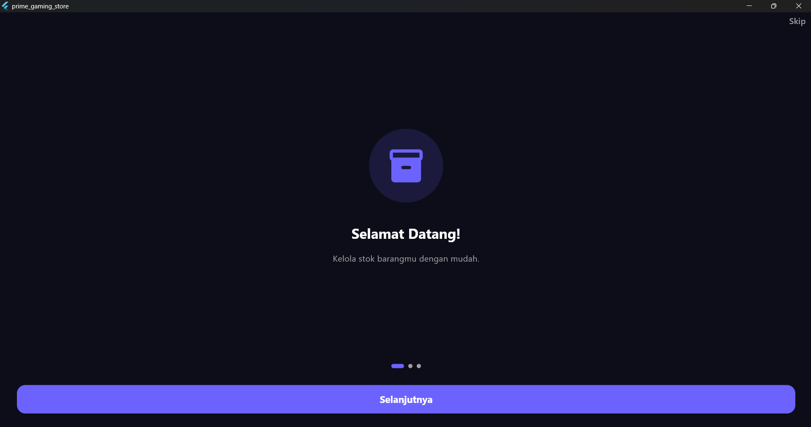 | 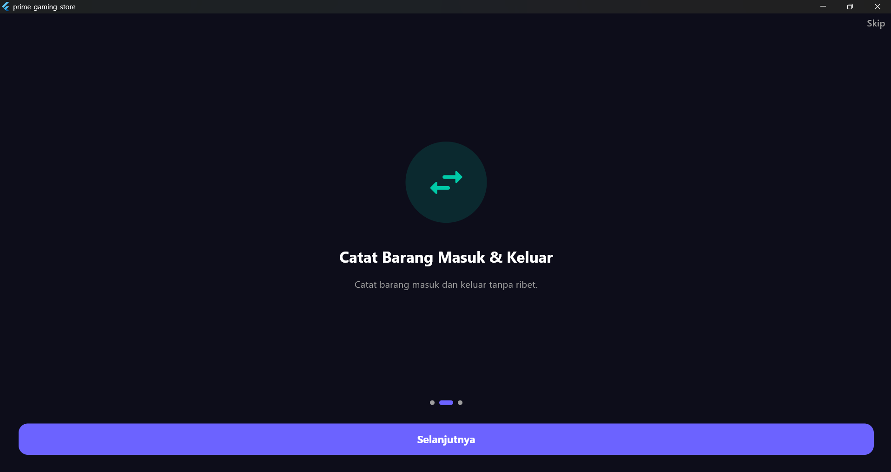 | 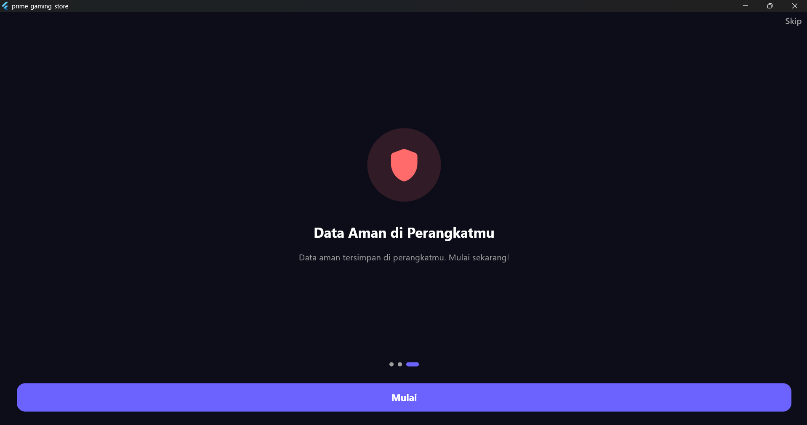 | 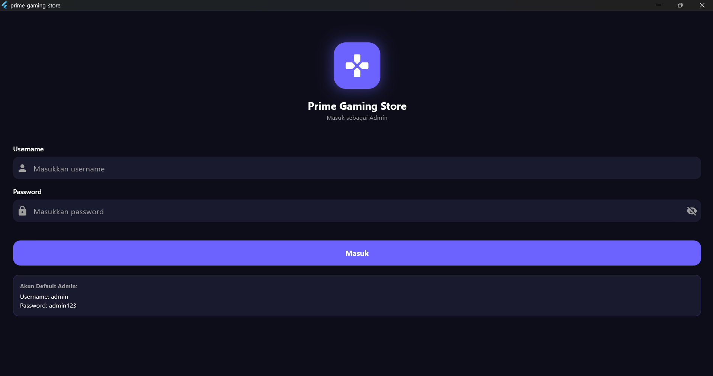 |

### Halaman Utama
| Dashboard | Produk | Detail Produk | Form Tambah |
|---|---|---|---|
| 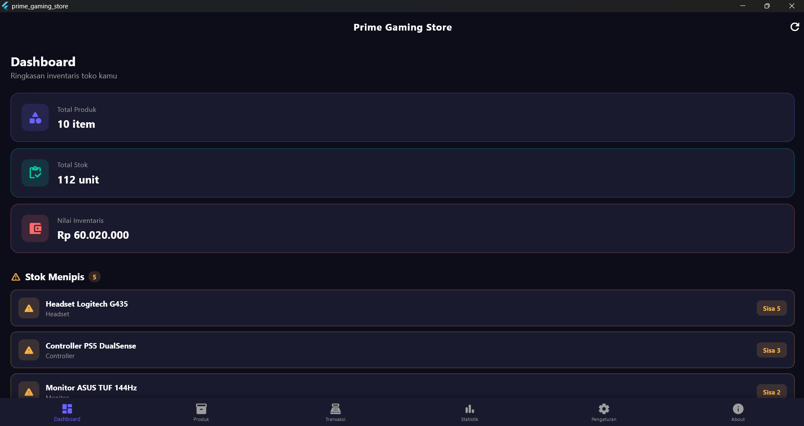 | 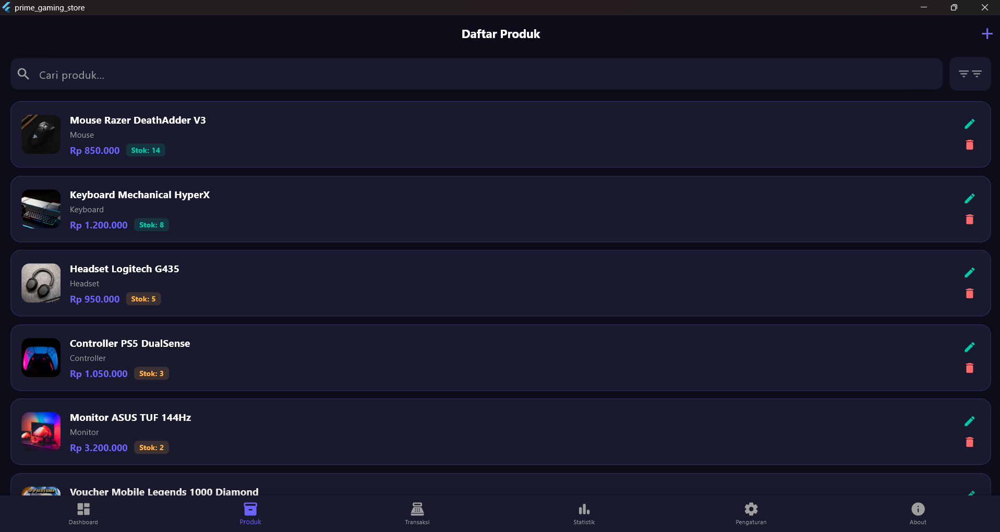 | 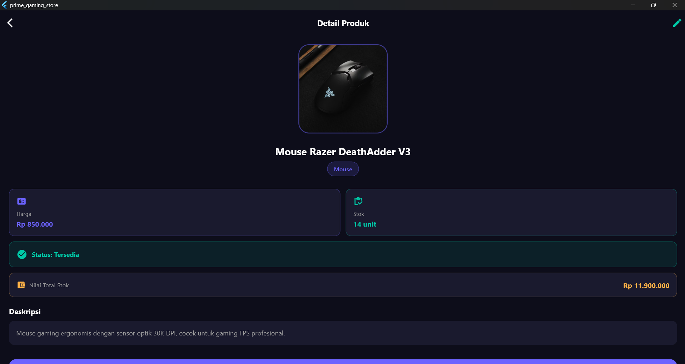 | 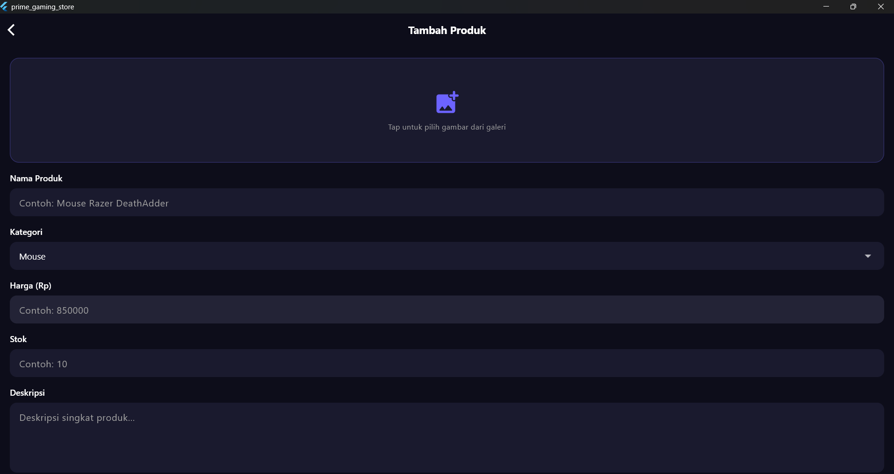 |

### Fitur Lainnya
| Transaksi | Riwayat | Statistik | Pengaturan |
|---|---|---|---|
| 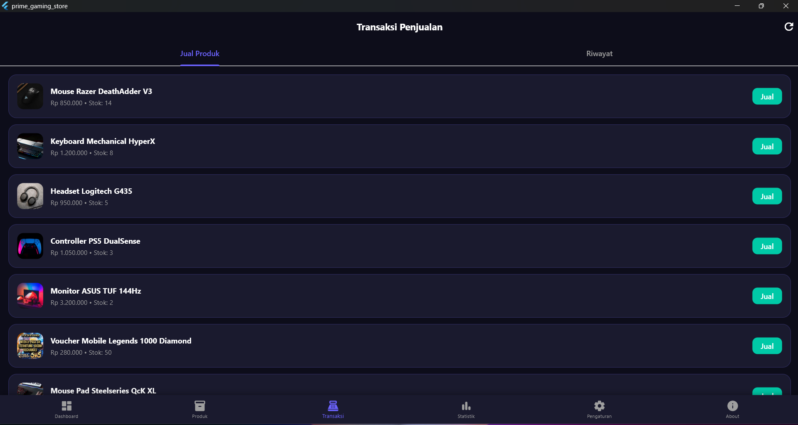 | 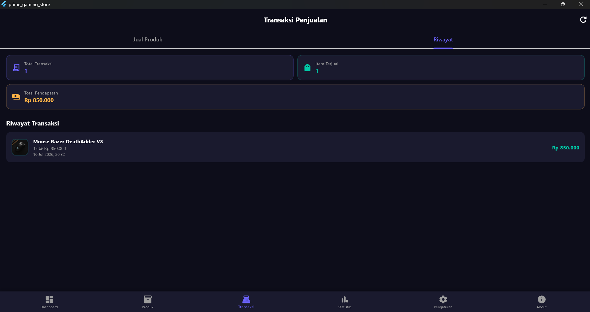 | 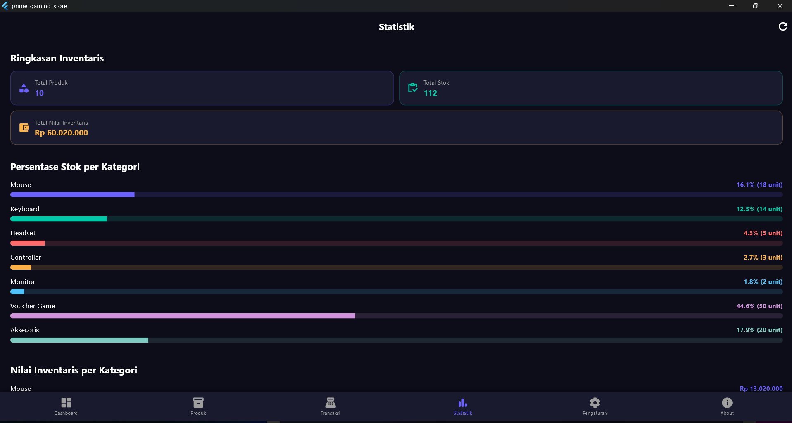 | 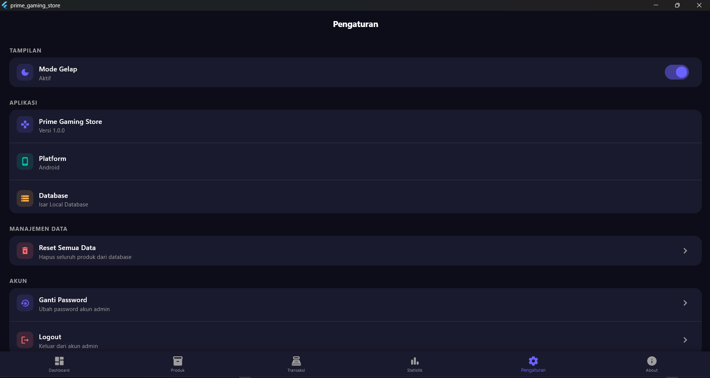 |

---

## 📥 Download APK

[⬇️ Download Prime Gaming Store APK](LINK_GOOGLE_DRIVE_KAMU)

---

## 🚀 Cara Build & Run

### Prerequisites
- Flutter SDK 3.x
- Android Studio / VS Code
- Android device / emulator (API 21+)

### Langkah-langkah
```bash
# Clone repository
git clone https://github.com/USERNAME_KAMU/prime-gaming-store.git

# Masuk ke folder project
cd prime-gaming-store

# Install dependencies
flutter pub get

# Generate Isar schema
dart run build_runner build --delete-conflicting-outputs

# Run aplikasi
flutter run

# Build APK
flutter build apk --release
```

---

## 📁 Struktur Project
lib/
├── main.dart
├── models/
│   ├── product.dart
│   ├── product.g.dart
│   ├── sales_transaction.dart
│   ├── sales_transaction.g.dart
│   ├── admin.dart
│   └── admin.g.dart
├── database/
│   └── isar_service.dart
├── providers/
│   └── theme_provider.dart
├── utils/
│   └── app_router.dart
└── screens/
├── splash_screen.dart
├── onboarding_screen.dart
├── login_screen.dart
├── home_screen.dart
├── dashboard_screen.dart
├── product_list_screen.dart
├── product_detail_screen.dart
├── product_form_screen.dart
├── transaction_screen.dart
├── stats_screen.dart
├── settings_screen.dart
└── about_screen.dart
---

*© 2025 Prime Gaming Store — D4 Bisnis Digital*
